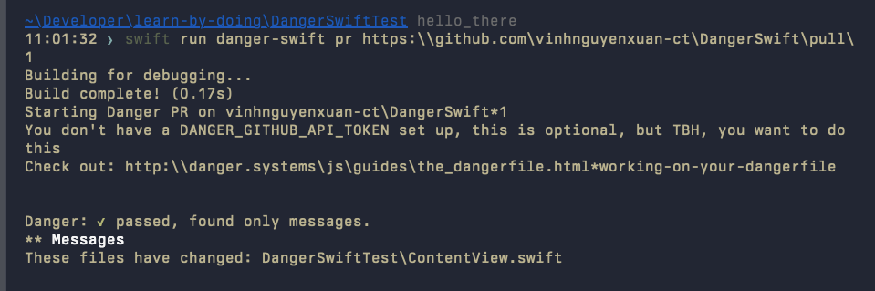

# DangerSwift

This is an example repo to Test Danger Swift integration

-   Dangerfile -> [here](https://github.com/vinhnguyenxuan-ct/DangerSwift/blob/main/Dangerfile.swift)

```
https://github.com/vinhnguyenxuan-ct/DangerSwift/blob/main/Dangerfile.swift
```

-   PR to test

```
https://github.com/vinhnguyenxuan-ct/DangerSwift/pull/1
```

-   Command to test danger locally

```
swift run danger-swift pr https://github.com/vinhnguyenxuan-ct/DangerSwift/pull/1
```

-   First run

    
